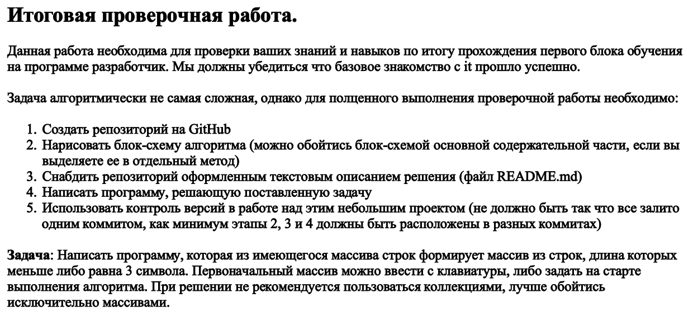
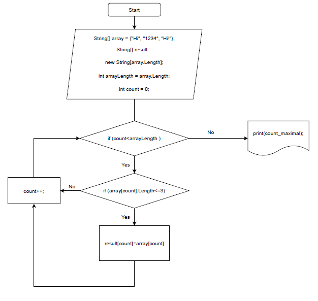

Блок схема:

Решение:
1. Создать: массив 1 со строками, пустой массив 2  равный по длинне первому.
2. Через цикл for пройтись по массиву 1: если длинна элемента массива >=3, то соранить в массив 2.
3. Вывести массив 2 на экран. 